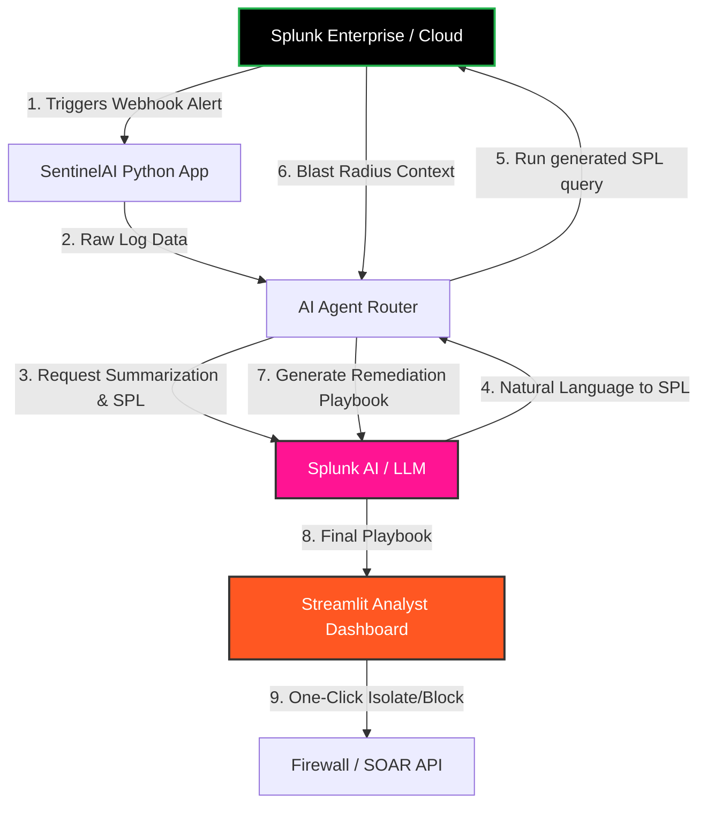

# 🛡️ Splunk SentinelAI - Autonomous SOC Co-Pilot

**Track:** Security  
**Submission for:** Splunk AI Hackathon 2026  

[](https://opensource.org/licenses/MIT)
[](https://www.python.org/downloads/)
[](https://www.splunk.com/)

---

## 📖 Project Overview

**Splunk SentinelAI** is an AI-powered autonomous Security Operations Center (SOC) co-pilot that dramatically reduces the time required to investigate and triage high-fidelity alerts. By leveraging Splunk's AI capabilities (specifically log summarization and NL-to-SPL generation) alongside custom LLM chains, SentinelAI transforms raw security alerts into actionable, human-readable insights and dynamic remediation playbooks.

### 🌟 Features & Functionality
- **Automated Alert Ingestion:** Connects directly to Splunk Webhooks or the REST API to pull high-severity alerts as they occur.
- **AI-Driven Contextualization:** Uses LLMs to parse complex logs, extracting Indicators of Compromise (IoCs) like IPs, hashes, and users automatically.
- **Natural Language to SPL:** Dynamically generates Splunk Search Processing Language (SPL) queries to investigate the "blast radius" around an alert, searching for related events occurring within the same timeframe.
- **Dynamic Playbook Generation:** Outputs step-by-step remediation instructions based on the specific threat vector identified in the Splunk logs.
- **One-Click Remediation:** Integrates with downstream SOAR platforms or firewalls to block IPs and isolate hosts.

## 🎥 Demo Video
*Since this is a hackathon submission template, upload your video to YouTube/Vimeo/Youku and place the link here.*

**[Link to YouTube Demo Video] (Placeholder)**  
*(See `demo_video_script.md` in this repository for the storyboard and script used in the video).*

---

## 🏗️ Architecture

Below is the architecture diagram showing how SentinelAI interacts with the Splunk Platform, AI Models, and data flows. 
*(You can also find the raw mermaid file `architecture_diagram.mmd` in the root of this repository).*



---

## 🚀 Setup & Run Instructions

This project includes a fully functional Streamlit frontend and Python backend. It can be run in **Mock Mode** (using included mock JSON datasets) or connected to a **Live Splunk Instance**.

### 1. Prerequisites
- Python 3.10+
- A virtual environment (recommended)

### 2. Installation
Clone the repository and install the dependencies:
```bash
git clone https://github.com/your-username/splunk-sentinel-ai.git
cd splunk-sentinel-ai
pip install -r requirements.txt
```

### 3. Environment Variables (Optional for Live Mode)
If you wish to connect to a live Splunk instance and use real OpenAI/Splunk AI endpoints, create a `.env` file in the root directory:
```env
SPLUNK_HOST=https://your-splunk-instance:8089
SPLUNK_TOKEN=your_bearer_token
OPENAI_API_KEY=your_openai_api_key
USE_MOCK_DATA=False
```
*(If `USE_MOCK_DATA` is not set or set to `True`, the app will safely run using the provided mock datasets in `/mock_data`).*

### 4. Running the Application
Launch the Streamlit dashboard:
```bash
streamlit run src/app.py
```
Open your browser to `http://localhost:8501`.

---

## 📂 Repository Structure

- `src/` - Application source code (Streamlit app, AI Agent logic, Splunk connector).
- `mock_data/` - Example configurations and datasets to evaluate the app without a Splunk instance.
- `requirements.txt` - Required Python dependencies.
- `architecture_diagram.mmd` - Mermaid JS Architecture Diagram.
- `demo_video_script.md` - The script used for the 3-minute hackathon pitch video.
- `LICENSE` - Open source MIT License.

---
*Built with ❤️ for the Splunk AI Hackathon 2026*
